# Flowchart — App Overview

```mermaid
flowchart LR
    Start["Start"] --> Upload["User uploads PDF (required)"]
    Upload --> SaveTemp["Save PDF to temporary file"]
    SaveTemp --> CheckDB["Check persisted Chroma DB for this PDF"]
    CheckDB -->|Yes| LoadDB["Load persisted Chroma vectorstore"]
    CheckDB -->|No| BuildDB["Build vectorstore: PyPDFLoader -> split -> embeddings -> Chroma"]
    LoadDB --> LoadModel["Load GPT4All model (cached)"]
    BuildDB --> LoadModel
    LoadModel --> Retriever["Create retriever (vectorstore.as_retriever, k=4)"]
    Retriever --> QA["Build RetrievalQA chain (map_reduce)"]
    QA --> UI["Streamlit UI: input box + Ask button"]
    UI --> Query["User submits query"]
    Query --> RunQA["Run QA chain -> LLM answers"]
    RunQA --> Display["Display answer & source snippets"]
    Display --> End["End"]
```

## Detailed explanation (professional)

1. **PDF upload (required)** — The user uploads a PDF via the Streamlit UI. The app saves the uploaded file to a temporary location so PDF loaders can read it reliably.
2. **Persisted DB check** — A short deterministic hash of the uploaded filename is used to pick a per-file persistence directory under `chroma_storage/`. If a persisted Chroma DB already exists for that upload, the app will attempt to load it to save processing time.
3. **Vectorstore build (if needed)** — If no persisted DB is found, the app:
   - Loads the PDF using `PyPDFLoader`,
   - Splits the document text into chunks using `CharacterTextSplitter` (configurable chunk size / overlap),
   - Converts chunks into dense vectors using `GPT4AllEmbeddings`,
   - Stores vectors in a Chroma vectorstore and persists it to disk for future runs.
4. **Model loading** — The local GGUF model (via GPT4All wrapper) is loaded and cached with Streamlit's `@st.cache_resource` so it isn't reloaded on every interaction.
5. **Retriever & QA chain** — A retriever is created from the Chroma vectorstore (`as_retriever(k=4)`), and a `RetrievalQA` chain (`map_reduce`) is built to fetch relevant chunks and prompt the local model.
6. **User query & response** — The user types a question; the chain retrieves relevant chunks, the local LLM composes an answer, and the app displays the answer and short source snippets (for traceability).

This layout keeps the app responsive (by reusing cached resources) and avoids committing large binary model files to the repository.
